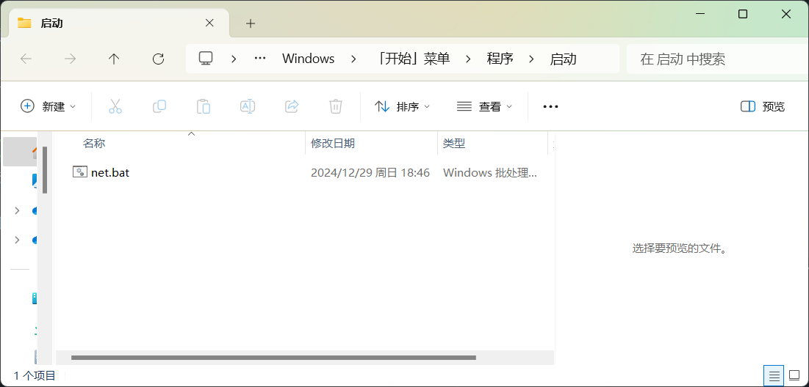

> “NetWork”
## 前言
这篇文章针对本人的需求设计而来，也为了需要自动登录校园网的同学提供一个相关思路。<br>
    本文所处的地理位置为：江西理工大学三江校区（东区）<br>
    网络环境：电信网<br>
由于电信网的原因，每登录24小时，网络就会自动断开，又要去浏览器页面重新登陆（对于一个把电脑扔在工作室的人来说，这是一件令人头疼的事）<br>


----
## 1、原理
首先打开[登录校园网](http://10.17.8.18/)的网页（前提是电脑已经连接了校园网JXUST-WLAN）<br>
按下 F12 打开浏览器开发者工具（如果没反应那就 fn + F12）<br>
输入账号密码，登录进入校园网<br>
找到这一串请求url，就是通过这一串url就能够成功登录校园网，把这一串复制下来

`http://10.17.8.18:801/eportal/portal/login?callback=dr1003&login_method=1&user_account=你的校园网账号%%40telecom&user_password=你的校园网密码。`<br>
其中，user_account就是学号；user_password就是密码；login_method是运营商信息。里面信息不需要全部保留也可以登录校园网，保留至user_password的结束位置也能登陆。<br>
在搜索栏直接粘贴上文所说的url点击回车，若出现下图的情况即联网成功。<br>
**原理可行！**<br>
那我只要每次开机的时候电脑能自动访问这段url那不就自动登录校园网了吗？<br>
直接进行实操!


----
## 2、实际操作
直接在桌面新建一个txt文本文件，将文件后缀名修改为`.bat`格式<br>
右键选择编辑或用记事本打开，在里面粘贴如下代码：<br>
```
@echo off
:: 设置控制台为 UTF-8 编码
chcp 65001
:: 启用延迟变量扩展
setlocal EnableDelayedExpansion
:: 初始化计数器
set /a counter=0
:loop
:: 增加计数器
set /a counter+=1
:: 输出当前是第几次判断
echo 当前为第 !counter! 次判断。
:: 检测是否有网络连接（超时 10 秒）
ping -n 1 -w 10000 baidu.com >nul 2>&1
if errorlevel 1 (
    echo 无网络连接（ping超时10秒），尝试在浏览器中访问登录页面...
    :: 指定浏览器路径（假设使用 Chrome）打开指定网址
    start "" "http://10.17.8.18:801/eportal/portal/login?callback=dr1003&login_method=1&user_account=你的校园网账号%%40telecom&user_password=你的校园网密码"
    echo 登录页面已在浏览器中打开。
) else (
    echo 网络连接正常，跳过登录操作...
)
:: 倒计时循环输出（每分钟输出一次）
for /l %%i in (5,-1,1) do (
    set /a minutes=%%i
    echo 倒计时（结束后会检测网络）：!minutes! 分
    timeout /t 60 >nul
)
:: 循环检测
goto loop
```

我对代码做一个简单的解释：（如果不想了解原理可以跳过该解释）<br>
这段代码主要功能是持续监测网络连接状况，并在网络断开时自动通过浏览器打开校园网登录页面。<br>首先，代码设置控制台编码为 UTF-8，并启用延迟变量扩展以便在循环中动态使用变量。然后，它初始化一个计数器，用于记录执行循环的次数。<br>接下来，进入一个无限循环，程序每次都会通过 ping 命令检测是否能够连接到百度，如果检测到网络连接失败，则输出“无网络连接”并尝试在默认浏览器中打开指定的校园网登录页面。如果网络正常，程序则输出“网络连接正常”，跳过登录操作。<br>为了避免频繁检测，代码会在每次检测后进入倒计时状态，每分钟输出倒计时信息，直到检测下次网络连接状态。整个过程会持续进行，直到手动终止脚本。<br><br>
注意：start "" "http://10.17.8.18:801/eportal/portal/login?callback=dr1003&login_method=1&user_account=你的校园网账号%%40telecom&user_password=你的校园网密码"<br>
这段代码的url需要你自己通过上面的方法去获取。<br>
<font color=red>接下来最重要的事一定要仔细看！</font><br>
<font color=red>接下来最重要的事一定要仔细看！</font><br><font color=red>接下来最重要的事一定要仔细看！</font><br><font color=red>重要的事说三遍！！！</font><br>
请检查你自己所获取到的url，在`校园网账号`后面应该会有`%40`字符，由于复制进脚本后，由脚本通过start命令发起访问会将`%40`识别为@，从而导致输进浏览器的url缺失这一关键信息<br>
解决方法为在`%40`这个字符前再加一个`%`，这样就能确保url的正确读取并访问。<br>
接下来运行这个.bat文件，就会自动向校园网登录端发送请求，然后登录你的校园网账号，并且每五分钟会ping一次百度的网站。<br>
若ping不通，则会再次执行登录请求。<br>
请在运行过程中不要关闭此命令行窗口！<br>
## 3、进阶操作
为了使开机能自动运行该脚本，需要将该脚本文件加入开机自启动。<br>
按win+r打开运行窗口，输入下述执行进入到开机启动目录：<br>
```
shell:startup
```
将编写好的.bat脚本复制进去，即可做到开机自动运行。<br>
<br>


