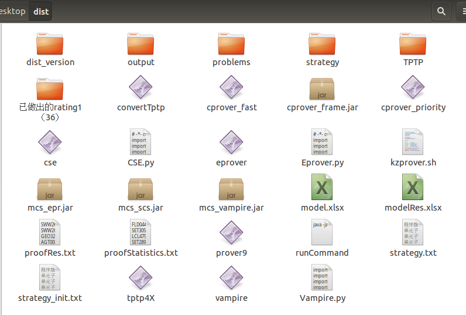

> “Work. ”

## 前言

进行此项内容前，请确保已经完成环境的配置。<br>
相关网站：[TPTP官网](https://www.tptp.org/)<br>
## 1、实验前准备

### 准备条件
拷贝好dist文件夹，确保内部具有正确的文件<br>
<br>
problems文件夹中存放问题以及Axiom公理集，测试完output中会存放生成相关文件，strategy中存放策略集合，proofStatistics.txt内存放所有问题的证明时间。<br>
在dist文件夹内打开命令行窗口，使用ls命令，检查文件是否具有可执行权限：<br>
`cse`,`eprover`,`tptp4X`,以及相关jar包。<br>
若没有权限，使用如下命令对文件授予权限：`chmod +x 文件名`<br>
使用`./eprover --verson`或`./vampire --verson`查看对应软件的版本<br>
使用命令行版本测试时，将`cse`替换为自己导出的`cse`<br>
替换eprover的版本时，要将`eprover`和`mcs_eprover.jar`同时替换才正确。<br>
3.1版本的Eprover会出现异常，则需要进行以下操作（重新打开一个终端，输入下述指令）：<br>
```
ps -ef|grep eprover
```
然后使用`kill`指令将前三个icdc进程杀死<br>
### 命令行版本测试命令
测试CSE和Eprover融合系统命令：<br>
```
java -jar mcs_epr.jar CSE_E problems 0 1 4 1 300 0 1 10
```

测试CSE和Vampire融合系统命令：
```
java -jar mcs_vampire.jar CSE_V problems 0 1 2 1 260 30 1 10
```

单独测试CSE系统命令：
```
java -jar mcs_scs.jar CSE problems 0 1 0 1 1 150
```
其中260 20 为时间参数
如果那两个数值变为300 0，意味着是原始测出来的数据，
前一个数值代表eprover测的时间，后一个数值代表CSE测的时间，
300秒减去前两个数值所剩下的时间也是eprover参与的

## 2、代码修改（基础项）
### 基础代码修改项

| **必改项**           |                                                   |                                                   |
| :---------------- | :------------------------------------------------ | :------------------------------------------------ |
| 2217              | Resolution.cpp                                    | for(int i=0;i<cla->uLitNum;++1i){删除1              |
|                   | 使用776行的main函数                                     | 替换原始800行的main函数                                   |
|                   |                                                   |                                                   |
| 验证检查              | 原始代码                                              | 修改后，会生成run文件                                      |
| Prover.cpp<br>319 | if(1){<br>        FileOp::delRunFiles();<br>    } | if(0){<br>        FileOp::delRunFiles();<br>    } |
|                   |                                                   |                                                   |
| **选改项**           |                                                   |                                                   |
| main.cpp          | debug                                             | 编译release                                         |
| 216               | \#define newTriDebug                              | //#define newTriDebug                             |
| 755               | //child = fork();<br>    if (0 == 0)              | child = fork();<br>if (child == 0) {              |
|                   |                                                   | 生成cse文件                                           |


文字变元输出<br>
```
cout<< QLit->subTerm->ToString()<<endl;//debug输出当前文字项
cout<<QLit->subTerm->ToStringBind()<<endl;//debug输出当前文字项和变元元替换项
```


