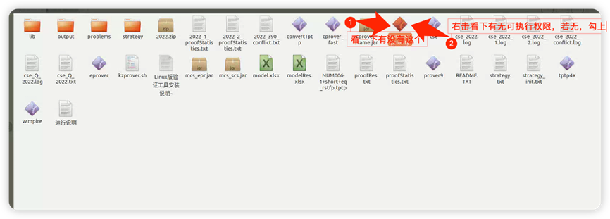
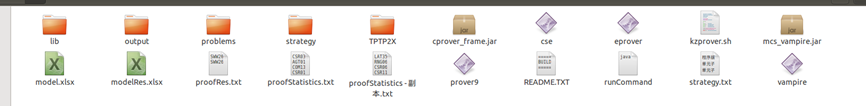
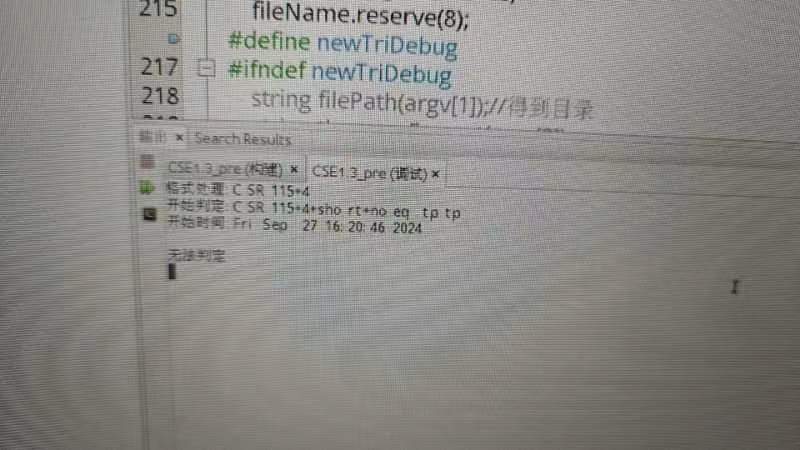

> “Work. ”

## 前言

安装前可以浏览这三个教程：<br>
[wsl安装教程](https://www.cnblogs.com/stellan/p/14409090.html)
<br>[安装wsl后虚拟机无法启动](https://blog.csdn.net/m0_74063149/article/details/137725577)
<br>[原生ubuntu安装教程](https://www.bilibili.com/opus/861067292754051097)<br><br>
如果想浏览相关的内容，可直接点击下面跳转：<br>
1.[安装系统](#jump1)<br>
2.[修改环境](#jump2)<br>
3.[相关代码修改（基础项）](#jump3)<br>
4.[纠错](#jump4)<br>
## <span id="jump1">1. 安装系统</span>

### 步骤1 - 启用适用于 Linux 的 Windows 子系统：
需要先启用“适用于 Linux 的 Windows 子系统”可选功能，然后才能在 Windows 上安装 Linux 分发。
以管理员身份打开 PowerShell 并运行：
```
dism.exe /online /enable-feature /featurename:Microsoft-Windows-Subsystem-Linux /all /norestart
```
### 步骤2 - 启用虚拟机功能：
安装 WSL 2 之前，必须启用“虚拟机平台”可选功能。 计算机需要虚拟化功能才能使用此功能。
以管理员身份打开 PowerShell 并运行：
```
dism.exe /online /enable-feature /featurename:VirtualMachinePlatform /all /norestart
```
### 步骤3 - 下载 Linux 内核更新包：
以管理员身份打开 PowerShell 并运行：
```
wsl --install
```
### 步骤4 - 将 WSL 2 设置为默认版本：
打开 PowerShell，然后在安装新的 Linux 发行版时运行以下命令，将 WSL 2 设置为默认版本：
```
wsl --set-default-version 2
```

### 步骤5 - 安装所选的 Linux 分发版：
•	[Ubuntu 16.04 LTS](https://www.microsoft.com/store/apps/9pjn388hp8c9)<br>•	[Ubuntu 18.04 LTS](https://www.microsoft.com/store/apps/9N9TNGVNDL3Q)<br>•	[Ubuntu 20.04 LTS](https://www.microsoft.com/store/apps/9n6svws3rx71)<br>•	[openSUSE Leap 15.1](https://www.microsoft.com/store/apps/9NJFZK00FGKV)<br>•	[SUSE Linux Enterprise Server 12 SP5](https://www.microsoft.com/store/apps/9MZ3D1TRP8T1)<br>•	[SUSE Linux Enterprise Server 15 SP1](https://www.microsoft.com/store/apps/9PN498VPMF3Z)<br>•	[Kali Linux](https://www.microsoft.com/store/apps/9PKR34TNCV07)<br>•	[Debian GNU/Linux](https://www.microsoft.com/store/apps/9MSVKQC78PK6)<br>•	[Fedora Remix for WSL](https://www.microsoft.com/store/apps/9n6gdm4k2hnc)<br>•	[Pengwin](https://www.microsoft.com/store/apps/9NV1GV1PXZ6P)<br>•	[Pengwin Enterprise](https://www.microsoft.com/store/apps/9N8LP0X93VCP)<br>•	[Alpine WSL](https://www.microsoft.com/store/apps/9p804crf0395)<br>

## <span id="jump2">2. 修改环境</span>

### 切换镜像
修改源：找到 `cd /etc/apt` 路径下的 sources.list 文件对其进行修改<br>在此路径下打开命令行，输入sudo vim sources.list<br>命令行中相关操作命令如下：<br>•	g 光标到头部<br>•	d 删除<br>•	shift + g 全部删除<br>•	i 写入<br>•	粘贴 以下 阿里源 或 清华源<br>•	ESC 退出写入模式<br>•	:wq 保存退出<br>
### 复制镜像源
```
deb http://mirrors.aliyun.com/ubuntu/ xenial main restricted universe multiverse  
deb http://mirrors.aliyun.com/ubuntu/ xenial-security main restricted universe multiverse  
deb http://mirrors.aliyun.com/ubuntu/ xenial-updates main restricted universe multiverse  
deb http://mirrors.aliyun.com/ubuntu/ xenial-backports main restricted universe multiverse  
##测试版源  
deb http://mirrors.aliyun.com/ubuntu/ xenial-proposed main restricted universe multiverse  
# 源码  
deb-src http://mirrors.aliyun.com/ubuntu/ xenial main restricted universe multiverse  
deb-src http://mirrors.aliyun.com/ubuntu/ xenial-security main restricted universe multiverse  
deb-src http://mirrors.aliyun.com/ubuntu/ xenial-updates main restricted universe multiverse  
deb-src http://mirrors.aliyun.com/ubuntu/ xenial-backports main restricted universe multiverse  
##测试版源  
deb-src http://mirrors.aliyun.com/ubuntu/ xenial-proposed main restricted universe multiverse  
# Canonical 合作伙伴和附加  
deb http://archive.canonical.com/ubuntu/ xenial partner  
deb http://extras.ubuntu.com/ubuntu/ xenial main
deb https://mirrors.tuna.tsinghua.edu.cn/ubuntu/ bionic main restricted universe multiverse
deb https://mirrors.tuna.tsinghua.edu.cn/ubuntu/ bionic-updates main restricted universe multiverse
deb https://mirrors.tuna.tsinghua.edu.cn/ubuntu/ bionic-backports main restricted universe multiverse
deb https://mirrors.tuna.tsinghua.edu.cn/ubuntu/ bionic-security main restricted universe multiverse
deb https://mirrors.tuna.tsinghua.edu.cn/ubuntu/ bionic-proposed main restricted universe multiverse
deb-src https://mirrors.tuna.tsinghua.edu.cn/ubuntu/ bionic main restricted universe multiverse
deb-src https://mirrors.tuna.tsinghua.edu.cn/ubuntu/ bionic-updates main restricted universe multiverse
deb-src https://mirrors.tuna.tsinghua.edu.cn/ubuntu/ bionic-backports main restricted universe multiverse
deb-src https://mirrors.tuna.tsinghua.edu.cn/ubuntu/ bionic-security main restricted universe multiverse
deb-src https://mirrors.tuna.tsinghua.edu.cn/ubuntu/ bionic-proposed main restricted universe multiverse
```


### 更新镜像
操作完成后使用如下命令更新镜像：<br>•	`sudo apt-get updata` 更新<br>•	`sudo apt-get upgrade` 更新<br>`sudo add-apt-repository ppa:openjdk-r/ppa`<br>安装jdk：`sudo apt-get install openjdk-8-jdk`<br><br>
**拓展篇(在环境Ubuntu/Mint物理机上安装python环境)：**<br>
```
ls /usr/bin/python*
```

```
update-alternatives --list python
```

```
sudo update-alternatives --install /usr/bin/python python /usr/bin/python3.6 1
```

```
sudo update-alternatives --install /usr/bin/python python /usr/bin/python2.7 2
```

```
sudo update-alternatives --config python
```

```
sudo apt install python3-pip
```
<br>

## <span id="jump3">3. 相关代码修改（基础项）</span>
### 基础代码修改项

| **必改项**           |                                                   |                                                   |
| :---------------- | :------------------------------------------------ | :------------------------------------------------ |
| 2217              | Resolution.cpp                                    | for(int i=0;i<cla->uLitNum;++1i){删除1              |
|                   | 使用776行的main函数                                     | 替换原始800行的main函数                                   |
|                   |                                                   |                                                   |
| 验证检查              | 原始代码                                              | 修改后，会生成run文件                                      |
| Prover.cpp<br>319 | if(1){<br>        FileOp::delRunFiles();<br>    } | if(0){<br>        FileOp::delRunFiles();<br>    } |
|                   |                                                   |                                                   |
| **选改项**           |                                                   |                                                   |
| main.cpp          | debug                                             | 编译release                                         |
| 216               | \#define newTriDebug                              | //#define newTriDebug                             |
| 755               | //child = fork();<br>    if (0 == 0)              | child = fork();<br>if (child == 0) {              |
|                   |                                                   | 生成文件                                              |
### 命令行版本测试命令
测试CSE和Eprover融合系统命令：<br>
```
java -jar mcs_epr.jar CSE_E problems 0 1 4 1 300 0 1 10
```


测试CSE和Vampire融合系统命令：
```
java -jar mcs_vampire.jar CSE_V problems 0 1 2 1 260 30 1 10
```


单独测试CSE系统命令：```
```
java -jar mcs_scs.jar CSE problems 0 1 0 1 1 150
```

## <span id="jump4">3. 纠错</span>
### 错误1：证明器不存在

检查dist文件夹下有没有这个cprover_priority

 若没有那就把cse 改成这个名字，然后再添加可执行权限
 
 ### 错误2：判定异常
 若验证检查结果异常，需记录判定情况，需要记录的有：
策略：多策略模式下为桌面的strategy文件夹；单策略模式下为strategy.txt文件
判定过程文件夹：桌面output文件夹下与判定例子同名的文件夹。
在代码操作中，指针越界
 ### 错误3：格式转换失败
 可能的原因：
1、没有放置公理集Axioms
2、没有使用Eprover融合系统，没有使用到转换的文件
3、由于问题的原因，可能无法转换
4、可能转换成功，但是界面显示错误
 ### 错误4：调试失败（一般少见）
 **问题：**
同样的例子在调试过程中超时导致无法判定
但是在带界面版本能得到不可满足
在别的电脑上调试也能成功
**解决方法：**
重装ubuntu系统
 