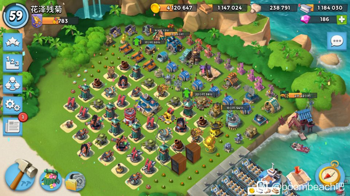
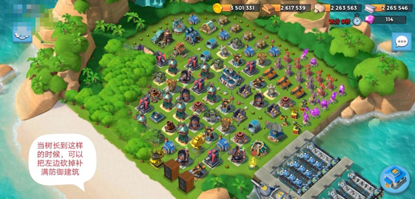
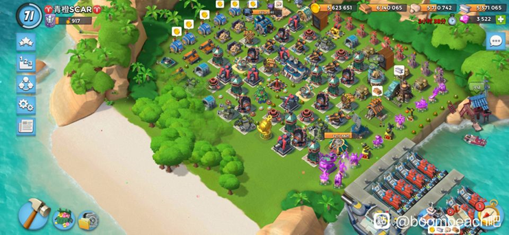

> “A Happy Game. ”
## 相关链接
海岛奇兵下载链接：[海岛奇兵国服](https://bb.qq.com/)<br>
海岛奇兵相关脚本：<br>
[梦想脚本](https://www.123865.com/s/yyl7Vv-A8OF3)(链接失效)<br>
[梦想模拟雕像](https://www.123865.com/s/yyl7Vv-o8OF3)(链接失效)<br>
养号说明：[单号配置](https://note.youdao.com/s/P86dxEYd)<br>

个人上传：[个人云盘海岛脚本](https://www.123pan.com/s/MEejVv-OEwo3.html)<br>

[最新版腾讯切号使用教程+qq突破登录上限说明](https://note.youdao.com/s/gBwzRrG)<br>

----
## 相关介绍
养号：<br>
```
ULGOXKK
```
查序列：<br>
```
VZNKMZK
```
[obsidian常用技巧](https://publish.obsidian.md/chinesehelp)，
[中文论坛](https://forum-zh.obsidian.md/)<br><br>
小号QQ：
- 龙行天下<br>
- 注册手机一加12<br>
- 2024年6月<br>
- 江西赣州<br>

----
## 沙滩树教程
<big><font color=blue>想种沙滩树要先种压岸树！</font></big><br>

### 1压岸树
压岸树首先将基地左上角靠山的位置空出来，别的位置用建筑填上，建筑直接的间隔不要留有大于(包括)2×2的位置（防止长树），确保树往左上角长。<br>

### 2砍部分树
当树长的较多的时候，可以将靠近上方的树砍掉，然后用建筑堵住，防止长回去，将树生长的方向挤向岸边。<br>


### 3挂脚本
当岸边长满树的时候，或者长较多树的时候，可以尝试开始挂航母脚本，促进沙滩树的生长。<br>



